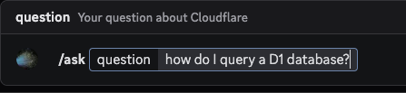
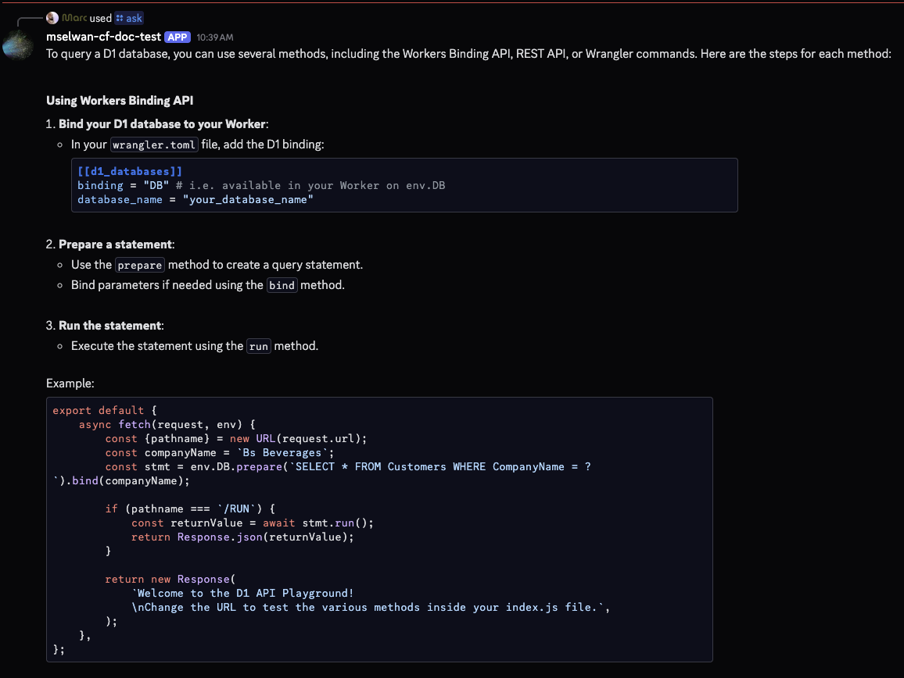
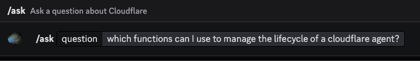
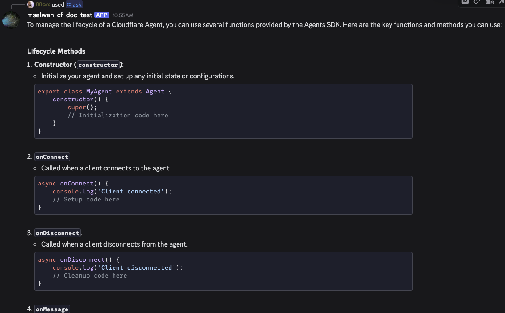

# Cloudflare Docs Discord Bot

A slightly vibe-coded example Discord bot that answers questions about Cloudflare. Built with [Cloudflare Agents SDK](https://github.com/cloudflare/agents) and [Cloudflare's Documentation MCP server](https://github.com/cloudflare/mcp-server-cloudflare/tree/main/apps/docs-vectorize) for accuracy. **Note** The LLM does **not** do tool calling with the docs MCP, rather, it uses it to do RAG with the user query instead. 





## What it does

- Answers questions about Cloudflare services using natural language
- Fetches relative docs from the Cloudflare Doc MCP server 
- Uses Workers AI (Qwen 2.5 Coder 32B) to generate the response (self contained)
- Optionally, has a placeholder example to use OpenAI instead in `src/agents.ts`
- Uses Durable Object state to keep chat history/context  

**Note - Discord messages are limited to 2000 characters** 

## Prerequisites

- Node.js 18+
- [Cloudflare account](https://dash.cloudflare.com/sign-up)
- [Discord account](https://discord.com) and [With Developer Access](https://discord.com/developers/applications)
- [Wrangler CLI](https://developers.cloudflare.com/workers/wrangler/install-and-update/) installed

## Quick Start

### 1. Install

```bash
npm install
```

### 2. Set Up the Discord App

1. Go to [Discord Developer Portal](https://discord.com/developers/applications)
2. Click "New Application" and give it a name
3. Go to the "Bot" section:
   - Click "Add Bot"
   - Copy the **Bot Token** (you'll need this later)
   - Enable "Message Content Intent" under "Privileged Gateway Intents"
4. Go to the "General Information" section:
   - Copy the **Application ID**
   - Copy the **Public Key**

### 3. Configure Secrets

Set up your Cloudflare Worker secrets:

```bash
# Discord credentials
npx wrangler secret put DISCORD_APPLICATION_ID

npx wrangler secret put DISCORD_PUBLIC_KEY

npx wrangler secret put DISCORD_BOT_TOKEN
```

### 4. Deploy

```bash
npm run deploy
```

Grab your Worker URL (e.g., `https://cloudflare-docs-discord-bot.your-subdomain.workers.dev`)

### 5. Register the Discord Commands

Call the setup endpoint to register the bot's commands:

```bash
curl -X POST https://your-worker-url.workers.dev/setup
```

You should see: `{"success":true,"message":"Discord commands registered successfully"}`

### 6. Configure the Discord Webhook

1. Go back to your Discord Application in the Developer Portal
2. Navigate to "General Information"
3. Under "Interactions Endpoint URL", enter: `https://your-worker-url.workers.dev/discord`
4. Discord will verify the URL (this may take a moment)

### 7. Invite the Bot to Your Server

1. In the Discord Developer Portal, go to "OAuth2" → "URL Generator"
2. Select scopes: **this is important, don't skip this**
   - `bot`
   - `applications.commands` 
3. Select bot permissions:
   - Send Messages
   - Use Slash Commands
4. Copy the generated URL and open it in your browser
5. Select your server and authorize the bot

## Usage

Once the bot is in your server, you can use these commands:

### `/ask [question]`

Ask any question about Cloudflare:






### `/help`

Display help information and example commands.

### `/reset`

Clear the conversation history/context for the current channel.

### Project Structure

```
cloudflare-docs-discord-bot/
├── src/
│   ├── index.ts           # Worker entry point
│   ├── agent.ts           # AI magic
│   ├── discord.ts         # Discord interaction handlers
│   └── types.ts           # TypeScript type definitions
├── wrangler.jsonc         # Cloudflare Workers configuration
├── package.json           # Node.js dependencies
├── tsconfig.json          # TypeScript configuration
└── README.md              # This file
```

### Using OpenAI Instead of Workers AI

The bot includes built-in support for OpenAI as an alternative to Workers AI. To switch to OpenAI:

1. **Install OpenAI SDK**:
   ```bash
   npm install openai
   ```

2. **Set your OpenAI API key**:
   ```bash
   npx wrangler secret put OPENAI_API_KEY
   ```

3. **Update `src/types.ts`** to add the key to your Env interface:
   ```typescript
   export interface Env {
     // ... existing fields
     OPENAI_API_KEY: string;
   }
   ```

4. **Edit `src/agent.ts`**:
   - Uncomment the OpenAI import at the top (line 8)
   - Replace the Workers AI code (lines 188-198) with the OpenAI code block (lines 200-220)

The OpenAI example includes models like `gpt-4o-mini`, `gpt-4`, and `o3-mini`. See the detailed instructions in the code comments.

**Learn more**: [Using AI Models with Cloudflare Agents](https://developers.cloudflare.com/agents/api-reference/using-ai-models/)

### Change Workers AI Model

Edit `src/agent.ts` line ~188 to use a different Workers AI model:

```typescript
// Current: Qwen 2.5 Coder (better one I tried)
this.env.AI.run('@cf/qwen/qwen2.5-coder-32b-instruct' as any, {
  messages,
  max_tokens: 600,
  temperature: 0.2,
})
```

Available models: [Workers AI Models](https://developers.cloudflare.com/workers-ai/models/)

### Custom System Prompt

Edit `systemPrompt` in `src/agent.ts` (~line 165) to change how the agent responds.

## Learn More

- [Cloudflare Agents SDK](https://github.com/cloudflare/agents) 
- [Agents API Reference](https://developers.cloudflare.com/agents/api-reference/agents-api/)
- [Using AI Models with Agents](https://developers.cloudflare.com/agents/api-reference/using-ai-models/)
- [Cloudflare MCP Server](https://github.com/cloudflare/mcp-server-cloudflare)
- [Workers AI Documentation](https://developers.cloudflare.com/workers-ai/)
- [Durable Objects Documentation](https://developers.cloudflare.com/durable-objects/)
- [Discord Bot Documentation](https://discord.com/developers/docs)
- [Model Context Protocol](https://modelcontextprotocol.io/)

